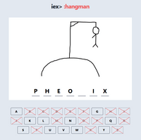

# Hangman
A simple Hangman game where you can play the classic Hangman game versus a friend (not finnished yet)



To create an Mnesia database:
 ```
  mix amnesia.create -d Database --disk
  ```

<!-- Not used - at the moment atleast -->
<!-- To create a Postgresql database with Docker:

 ```
  docker run --name hangman-postgres -p 5432:5432 -e POSTGRES_PASSWORD=password -d postgres
  ```
  
* Update /config/dev.exs with your correct information  -->

To start your Phoenix server:

  * Install dependencies (including Node.js deps) with `mix setup`
  * Start Phoenix endpoint with `mix phx.server`

Now you can visit [`localhost:4000`](http://localhost:4000) from your browser.


